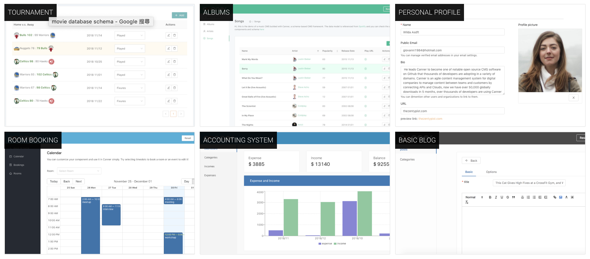

<p align="center">
  <a href="#"></a>
</p>

<div align="center">

[](https://badge.fury.io/js/canner)
[](https://www.npmjs.com/package/canner)
[](https://circleci.com/gh/Canner/canner)
[](https://gitter.im/Canner/CannerCMS?utm_source=share-link&utm_medium=link&utm_campaign=share-link)
[](https://twitter.com/cannerIO)
[](https://twitter.com/intent/tweet?text=Canner%2C%20an%20agile%20Content%20Management%20System%20for%20APIs%20and%20Clouds.%20Build%20CMS%20faster%20and%20simpler%20with%20GraphQL%2C%20Prisma%2C%20Firebase%20and%20Restful%20APIs.%20%F0%9F%91%89https%3A%2F%2Fgithub.com%2FCanner%2Fcanner)

</div>

<br/><br/>
> Canner, a CMS framework built for devlopers. Build CMS faster and simpler with GraphQL, Prisma, Firebase and Restful APIs.

Are you using Canner? Please share with us [here](https://github.com/Canner/canner/issues/133). Once we approve, you will get **one month PREMIUM plan** for your account!

## Benefits and advantages (Simple. Agile. Flexible. Efficient - SAFE)

### 🌍 Simple, One Framework

Canner is flexible and agnostic, that you can ***learn once and create any form of CMS for many different databases.***

### ⚡️ Agile, Move Faster

By defining a Canner schema in JSX, you can determine how the CMS stores data in your databases and the appearance of the CMS UI/UX.

### 💪 Flexible, any Data Sources

With different connectors, you are able to create a CMS to interact with ***Firebase, MySQL, PostgreSQL, GraphQL with the same schema***.

### 💸 Efficient, Less is More

Since Canner schema ***is only a JSX (XML-like) language without any logistic code***, in other words, you can maintain your code in a configuration file and easy to maintain using version controls.

## Features

### CMS features

- [x] [30+ CMS components](https://www.canner.io/component)
- [x] [Support Layouts](https://www.canner.io/docs/schema-layout-tags)
- [x] [Support Queries](https://www.canner.io/docs/schema-toolbar-tags)
- [x] [Support Chart](https://www.canner.io/docs/schema-page-tags)
- [x] [Support i18n](https://www.canner.io/docs/guides-internationalization)
- [x] [Support Validation](https://www.canner.io/docs/guides-validation)
- [x] [Support Condition](https://www.canner.io/docs/guides-condition-fields)
- [x] [Support Customization](https://www.canner.io/docs/guides-customized-component)

### Sources and API

- [x] [Connect to multiple sources](https://www.canner.io/docs/credential-intro)
  * [Firebase](https://www.canner.io/docs/credential-firebase)
  * [Firestore](https://www.canner.io/docs/credential-firestore)
  * [Prisma](https://www.canner.io/docs/credential-prisma)
- [x] [Customize resolver](https://www.canner.io/docs/guides-resolver)
- [x] [Storage API support](https://www.canner.io/docs/guides-storage)


## Documentation

Full documentation: https://www.canner.io/docs

## Preview and demo



<b><a href="https://cms30.canner.io">30 CMS demos using Canner</a></b>

## 🔥🔥 Only 3 commands to start 🔥🔥

```sh
# 1. Download Canner CLI tool
➜ $ npm install --global @canner/cli

# 2. Initialize schema
➜ $ canner init:schema
# Answer the questions
# Initializing schema...
# ? What template do you want to create? (Use arrow keys)
#   None
# ❯ Blog
#   Company
#   E-commerce
# ? What data source do you want to use?
#   None
#   Firebase admin
#   Firebase client
# ❯ Prisma
✔ Initialized

# 3. Serve your CMS with Livereload in local, while you update your schema the dev server will automatically reload open http://localhost:9090
➜ $ canner script:serve
```

***👉👉 START USING CANNER: https://www.canner.io***


## Why Canner is different?

Canner adopts Adaptive CMS concept. Adaptive CMS is a new CMS structure that is different from traditional CMS and headless CMS. The biggest different about Adaptive CMS is that it decouples both view and data layer. It builds data interfaces to connect to single or multiple data sources.

> ***Adaptive CMS?*** Learn more [here](https://www.canner.io/docs/why-adaptive-cms)


### Learn more about Canner.

* ***Why create Canner?*** See [here](https://www.canner.io/docs/why-canner)

* ***Our mission at Canner:*** See [here](https://www.canner.io/docs/why-mission.html)


## Demo

### Canner connect to Firebase

CMS for Firebase with SSR supported (NextJS) https://github.com/Canner/canner-firebase-cms

### Canner connect to Firestore

CMS with Canner and Firestore, and deploy to Firebase hosting https://github.com/Canner/canner-firestore-cms


**More demo visit [/examples folder](./examples) & [canner-demo](https://github.com/Canner/canner-demo) and  [canner.io](https://www.canner.io/)**

### Instructions
- Firebase - realtime database: https://www.canner.io/docs/tutorial-connect-to-firebase
- Prisma: https://www.canner.io/docs/tutorial-connect-to-prisma

### Blog posts

- Step by Step tutorial: https://www.canner.io/docs/start-quick-html5up
- Why Firebase CMS: https://www.canner.io/docs/why-firebase-cms

## Develop

Install all dependencies.

We are using yarn workspace to manage all repos, learn more about [Yarn workspace](https://yarnpkg.com/blog/2017/08/02/introducing-workspaces/)

To install packages

```
yarn
```

## Roadmap

Interested in our next roadmap to v3? Please follow issue [here](https://github.com/Canner/canner/issues/123).


## License

Apache-2.0


