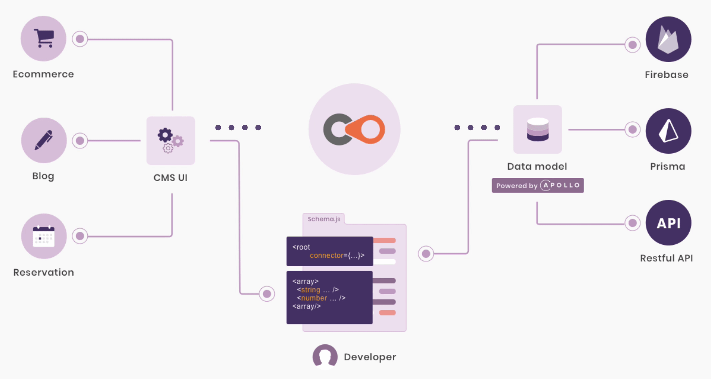
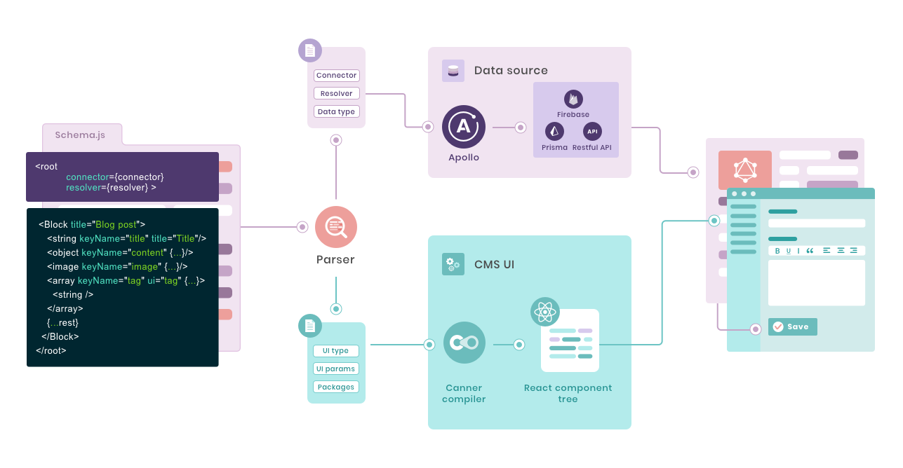
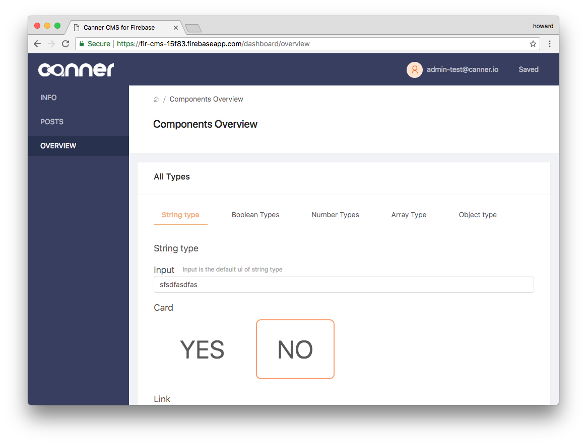
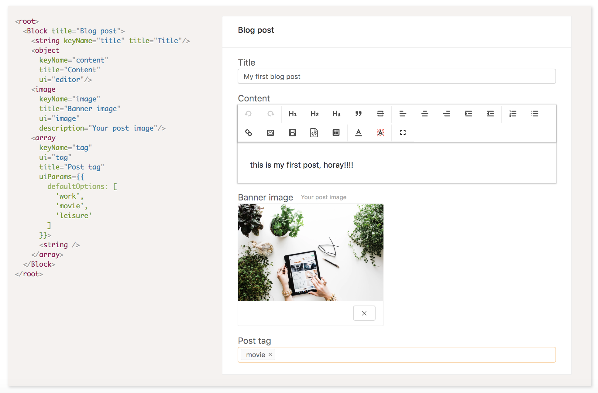

[](https://badge.fury.io/js/canner)
[](https://circleci.com/gh/Canner/canner)
[](https://gitter.im/Canner/CannerCMS?utm_source=share-link&utm_medium=link&utm_campaign=share-link) 
[](https://twitter.com/cannerIO)
 [](https://twitter.com/intent/tweet?text=Universal%20CMS%20framework%20in%20React%20JSX(XML-like)%20for%20Firebase%2C%20GraphQL%2C%20Restful%20API%2C%20Prisma%20using%20%40cannerIO%2C%20open%20source%20at%3A%20https%3A%2F%2Fgithub.com%2FCanner%2Fcanner)

> Canner is a universal CMS framework that allows you to build CMS in React JSX(XML-like) for Firebase, GraphQL, Restful API, Prisma, in other words, an agnostic CMS framework for any applications and data sources. 



## Benefits and advantages

### 🌍 Universal CMS framework

Canner is extremely flexible and agnostic, that you can ***learn once and create any form of CMS for many databases.***

### ⛄ Create data model and UI design at the same time.

While you are defining Canner schema in JSX, you are defining how your CMS store your data in your databases, and how your CMS UI/UX should look like.



### 👩‍💻 One schema to any database

With different connectors, you are able to create a CMS to interact with ***Firebase, MySQL, PostgreSQL, GraphQL with the same schema***.

### 😎 Easy to maintain and extend

Since Canner schema ***is only a JSX (XML-like) language without any logistic code***, in other words, you can maintain your code in a configuration file and easy to maintain using version controls.

## 🔥🔥 Only 3 commands to start 🔥🔥

```sh
# 1. Download Canner CLI tool
➜ $ npm install --global @canner/cli

# 2. Initialize schema
➜ $ canner init:schema
# Answer the questions
# Initializing schema...
# ? What template do you want to create? (Use arrow keys)
#   None
# ❯ Blog
#   Company
#   E-commerce
# ? What data source do you want to use?
#   None
#   Firebase admin
#   Firebase client
# ❯ Prisma
✔ Initialized

# 3. Serve your CMS with Livereload in local, while you update your schema the dev server will automatically reload open http://localhost:9090
➜ $ canner script:serve
```

## Preview and demo



### CMS schema

Using Canner, You only need to upload a XML-like(JSX) syntax, to create any kind and form of applications. Our CMS has built **CMS for websites, mobile apps, and even chatbot applications**. Amazingly, you can building a ***blog CMS within 200 lines of code, as for basic E-commerce CMS within 300 lines of code using Canner and select connector to connect to data sources, such as Firebase, GraphQL, Restful API, Prisma.***

Wonder why we use JSX? [read here](https://www.canner.io/docs/why-jsx)



**More demo visit [here](https://www.canner.io/)**

## 🙌 Why create Canner?

Before we built Canner CMS framework, we've tried most of CMS framework such as Wordpress, Drupal, etc. What we found was that getting simple functions to work was easy enough, but once you try to build and scale into your product or your service you ran into deeper issues...

1. **Humongous codebase:**  Each CMS framework is humongous and complex, if you want to use them you have to install a huge codebase into your system, and most of the time it'll affect and mess with all your existing code.

> Canner's CMS is only a React component.

2. **Hardcoded and limited APIs:**  APIs should not predefined and even hard coded into codebase, which is critical for building advanced use cases and impossible to build into your system.

> Canner don't predefine any API and data structure.

3. **Re-inventing the view layer seemed inefficient and limiting:**  Most CMS rolled their own views, instead of using existing technologies like `React`, so you have to learn a whole new system, in order to make some changes.

> Canner natively allows you to use `React` components.

4. **CMSes are binded with frontend code:**  Many CMSes bind with frontend code, so there are many needless and complex conventional namings and settings in your codebase, you have to learn all the system before start designing your theme.

> Canner is an agnostic CMS for any application, includes websites, mobile apps, IoTs, and even chatbots.

5. **Vendor lock-in:** Many CMSes are locked into a specific database and service, it's impossible to switching existing cloud services or databases later.

> Canner allows you to connect any database and host anywhere, we even allow you to use Canner in hybrid clouds.

6. **Building complex, nested CMS was impossible:** Many CMS are design for simple use cases such as blog, ecommerce websites. As your service grow larger and complex, you'll run into several bottlenecks to grow your CMS that fits.

> Canner use schema to define your CMS, it could scale, and could be built in large applications and usages.

7. **Building CMS fit your APIs was impossible:** Most CMS are **not purely** CMS, they are design for building templates in it's own structure and platform.  So it's nearly impossible to build CMS that fit into your existing infrastructure.

> Canner adapts to your APIs.

8. **Design CMS structure is like managing a huge code base:** Maintaining your CMS structure is like mess with huge code base with lots of conventions that you must follows.

> Canner is only a `React` component.

Of course not every CMS exhibits all these issues, but if you tried using another CMS you might have run into similar problems.

If that sounds familiar, you might like ***Canner***. Which motivates us to solve these problems.

> If you are interested in how we solve these problems see [Our mission](https://www.canner.io/docs/why-mission.html)

***LOVE OUR IDEA AND CONCEPT? STAR OUR PROJECT 🌟🌟 AND [](https://twitter.com/cannerIO)***

- Visit Canner official site to learn more: https://www.canner.io
- Canner documentation: https://www.canner.io/docs/guides-community-intro.html

***👉👉 START USING CANNER: https://www.canner.io***

## Get started

- Firebase - realtime database: https://www.canner.io/docs/start-quick-firebase.html
- Prisma: https://www.canner.io/docs/start-quick-prisma.html


## Demo

### Canner connect to firebase

- live demo: https://fir-cms-15f83.firebaseapp.com/login
- repo: https://github.com/Canner/canner-firebase-cms

### HTML5UP templates using Canner

- live demo:  https://www.canner.io/demo
- repo: https://github.com/Canner/canner-html5up-demo

**Posts**

- Step by Step tutorial: https://www.canner.io/docs/start-quick-html5up.html
- Why Firebase CMS: https://www.canner.io/docs/why-firebase-cms.html

## Intoduce Adaptive CMS Framework

Canner advocate a new CMS structure called ***Adaptive CMS*** it is a novel CMS structure that differs from traditional CMS and headless CMS. The biggest difference is that Adaptive CMS decouples the view and data layers and builds data interfaces to connect to single or multiple data sources.


> Learn more [Why Adaptive CMS?](http://www.canner.io/docs/why-adaptive-cms.html)


## License

Apache-2.0


