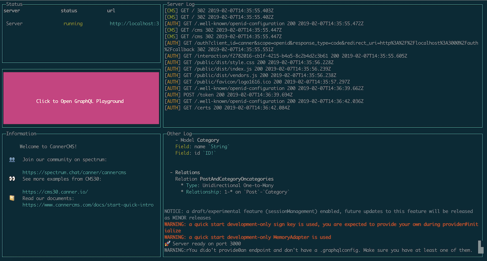
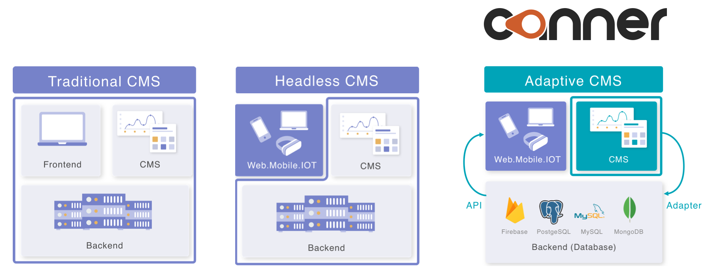

<p align="center">
  <a href="#"></a>
</p>

<div align="center">

[](https://badge.fury.io/js/%40canner%2Fcli)
[](https://www.npmjs.com/package/canner)
[](https://circleci.com/gh/Canner/canner)
[](https://spectrum.chat/canner/cannercms)
[](https://opencollective.com/cannercms)
[](https://twitter.com/cannerIO)
[](https://twitter.com/intent/tweet?text=Canner%2C%20an%20agile%20Content%20Management%20System%20for%20APIs%20and%20Clouds.%20Build%20CMS%20faster%20and%20simpler%20with%20GraphQL%2C%20Prisma%2C%20Firebase%20and%20Restful%20APIs.%20%F0%9F%91%89https%3A%2F%2Fgithub.com%2FCanner%2Fcanner)

</div>

<div align="center">

[✨ Major release: Canner v3 is now live!! ✨](https://www.cannercms.com/blog/2019/02/07/canner-v3)

</div>

<br/><br/>
> CannerCMS lets you build flexible content management systems easy and fast, CMS developers built for CMS developers.
>
> Template CMS, Content Management System can build websites fast, but clients often need custom solutions? Well, what CannerCMS do is let creating custom CMS fast and easy with many clouds.

<div align="center">
  
***Hire us for professional service to create your awesome CMS using Canner? Contact us at contact@canner.io***

</div>

[](https://www.youtube.com/watch?v=OVdxvGDGORs)

## Benefits and advantages (Simple. Agile. Flexible. Efficient - SAFE)

### 🌍 Simple, One Framework

CannerCMS is flexible and agnostic, that you can ***learn once and create any form of CMS for many different databases.***

### ⚡️ Agile, Move Faster

By defining a Canner schema in JSX, you can determine how the CMS stores data in your databases and the appearance of the CMS UI/UX.

### 💪 Flexible, any Data Sources

With different connectors, you are able to create a CMS to interact with ***Firebase, MySQL, PostgreSQL, GraphQL with the same schema***.

### 💸 Efficient, Less is More

Since Canner schema ***is only a JSX (XML-like) language without any logistic code***, in other words, you can maintain your code in a configuration file and easy to maintain using version controls.

## Features

### CMS features

- [x] [30+ CMS components](https://www.cannercms.com/component)
- [x] [Support Layouts](https://www.cannercms.com/docs/schema-layout-tags)
- [x] [Support Queries](https://www.cannercms.com/docs/schema-toolbar-tags)
- [x] [Support Chart](https://www.cannercms.com/docs/schema-page-tags)
- [x] [Support i18n](https://www.cannercms.com/docs/guides-internationalization)
- [x] [Support Validation](https://www.cannercms.com/docs/guides-validation)
- [x] [Support Condition](https://www.cannercms.com/docs/guides-condition-fields)
- [x] [Support Customization](https://www.cannercms.com/docs/guides-customized-component)

### Sources and API

- [x] [Connect to multiple sources](https://www.cannercms.com/docs/credential-intro)
  * [Firebase](https://www.cannercms.com/docs/credential-firebase)
  * [Firestore](https://www.cannercms.com/docs/credential-firestore)
  * [Prisma](https://www.cannercms.com/docs/credential-prisma)
- [x] [Customize resolver](https://www.cannercms.com/docs/guides-resolver)
- [x] [Storage API support](https://www.cannercms.com/docs/guides-storage)


## Documentation

Full documentation: https://www.cannercms.com/docs


## Preview and demo


<b><a href="https://cms30.canner.io">30 CMS demos using Canner</a></b>

## 🔥🔥 Only 3 commands to start 🔥🔥



```sh
# 1. Download Canner CLI tool
➜ $ npm install --global @canner/cli

# 2. Initialize schema
➜ $ canner init
# Answer the questions
# Initializing schema...
# ? What template do you want to create? (Use arrow keys)
#   None
# ❯ Blog
#   Company
#   E-commerce
# ? What data source do you want to use?
#   None
#   Firebase admin
#   Firebase client
# ❯ Prisma
✔ Initialized

# 3. Serve your CMS with Livereload in local, while you update your schema the dev server will automatically reload open http://localhost:9090
➜ $ canner start
```

***👉👉 START USING CANNER: https://www.cannercms.com***

## Backers

**We are currently a very small team**, your support will inspire us to provide better and better software. Support us with a monthly donation and help us continue our activities. [[Become a backer](https://opencollective.com/cannercms#backer)]

<a href="https://opencollective.com/cannercms/backer/0/website" target="_blank"></a>
<a href="https://opencollective.com/cannercms/backer/1/website" target="_blank"></a>

## Sponsors

[Open Collective sponsors](https://opencollective.com/cannercms#sponsers)

<a href="https://opencollective.com/cannercms/sponsor/0/website" target="_blank"></a>

## Open source vs. CannerCMS cloud

Worrying about hosting, updates, security problems? Use [CannerCMS cloud](https://www.cannercms.com) - Just create CMS schema, we will do the rest.

<table>
  <tr>
    <th></th>
    <th>Open Source Edition</th> 
    <th>CannerCMS cloud</th>
  </tr>
  <tr>
    <td><b>Authentication Server</b></td>
    <td>Single User</td> 
    <td>Pay as you go</td>
  </tr>
  <tr>
    <td><b>CMS server</b></td>
    <td>Self-host</td> 
    <td>✅</td>
  </tr>
  <tr>
    <td><b>API server</b></td>
    <td>Self-host</td> 
    <td>✅</td>
  </tr>
  <tr>
    <td><b>Global CDN</b></td>
    <td>🚫</td> 
    <td>✅</td>
  </tr>
  <tr>
    <td><b>Role permission</b></td>
    <td>🚫</td> 
    <td>✅</td>
  </tr>
  <tr>
    <td><b>Sandbox testing</b></td>
    <td>🚫</td> 
    <td>✅</td>
  </tr>
  <tr>
    <td><b>Event logging</b></td>
    <td>🚫</td> 
    <td>✅</td>
  </tr>
  <tr>
    <td><b>Multiple language</b></td>
    <td>🚫</td> 
    <td>✅</td>
  </tr>
  <tr>
    <td><b>Deployment logging</b></td>
    <td>🚫</td> 
    <td>✅</td>
  </tr>
  <tr>
    <td><b>API authentication</b></td>
    <td>🚫</td> 
    <td>✅</td>
  </tr>
  <tr>
    <td><b>Security check</b></td>
    <td>🚫</td> 
    <td>✅</td>
  </tr>
  <tr>
    <td><b>Automatically upgrade</b></td>
    <td>🚫</td> 
    <td>✅</td>
  </tr>
</table>


## Why Canner is different?

Canner adopts Adaptive CMS concept. Adaptive CMS is a new CMS structure that is different from traditional CMS and headless CMS. The biggest different about Adaptive CMS is that it decouples both view and data layer. It builds data interfaces to connect to single or multiple data sources.

> ***Adaptive CMS?*** Learn more [here](https://www.cannercms.com/docs/why-adaptive-cms)



### Learn more about Canner.

* ***Why create Canner?*** See [here](https://www.cannercms.com/docs/why-canner)

* ***Our mission at Canner:*** See [here](https://www.cannercms.com/docs/why-mission.html)


## Demo

### Canner connect to Firebase

CMS for Firebase with SSR supported (NextJS) https://github.com/Canner/canner-firebase-cms

### Canner connect to Firestore

CMS with Canner and Firestore, and deploy to Firebase hosting https://github.com/Canner/canner-firestore-cms


**More demo visit [/examples folder](./examples) & [canner-demo](https://github.com/Canner/canner-demo) and  [cannercms.com](https://www.cannercms.com/)**

### Instructions
- Firebase - realtime database: https://www.cannercms.com/docs/tutorial-connect-to-firebase
- Prisma: https://www.cannercms.com/docs/tutorial-connect-to-prisma

### Blog posts

- Step by Step tutorial: https://www.cannercms.com/docs/start-quick-html5up
- Why Firebase CMS: https://www.cannercms.com/docs/why-firebase-cms

## Develop

Install all dependencies.

We are using yarn workspace to manage all repos, learn more about [Yarn workspace](https://yarnpkg.com/blog/2017/08/02/introducing-workspaces/)

To install packages

```
yarn
```

## Roadmap

Interested in our next roadmap to v4? Please follow issue [here](https://github.com/Canner/canner/issues/123).


## License

Apache-2.0


